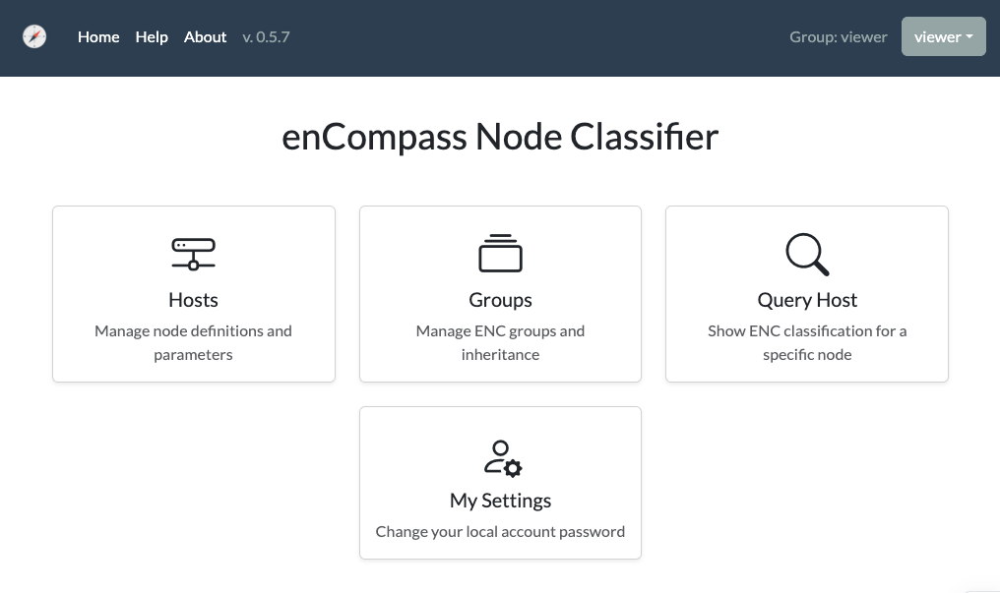

# enCompass

enCompass is a Django-based Puppet External Node Classifier (ENC) packaged for Docker.

It provides a web UI to manage hosts and groups, plus read-only ENC endpoints for external consumers.

**Demo site**: [encompass-demo.geant.org](https://encompass-demo.geant.org/)



## Index

- [Features](#features)
- [Deployment](#deployment)
  - [Nomad Deployment](#nomad-deployment)
  - [Kubernetes Deployment](#kubernetes-deployment)
  - [Docker Compose](#docker-compose)
    - [Quick Start (Docker)](#quick-start-docker)
- [Endpoints](#endpoints)
- [Puppet ENC Integration](#puppet-enc-integration)
- [Configuration](#configuration)
  - [Core settings](#core-settings)
  - [Puppet environments](#puppet-environments)
  - [Authentication](#authentication)
  - [ENC Viewer Basic Auth](#enc-viewer-basic-auth)
  - [SSL](#ssl)
- [Data Backup](#data-backup)
- [HA considerations](#ha-considerations)
- [Security Checklist](#security-checklist)
- [ToDo](#todo)
- [License](#license)

## Features

- Host and group management UI
- ENC host query view for classification checks
- Autoscale is possible. The container is stateless
- LDAP and Database authentication modes
- Optional read-only basic auth for ENC endpoints
- Optional SSL listeners through Nginx
- Persistent YAML data via Git repository

## Deployment

### Nomad Deployment

You can use [encompass-demo.nomad](examples/encompass-demo.nomad) and adjust it to your needs.

The job contains:

- service registration for Consul
- secrets templates fetched from Vault
- tags declarations for Traefik

### Kubernetes Deployment

Help needed!

### Docker Compose

- Docker + Docker Compose
- Open local ports: `8080`, `8081`, `8443`, `8444`

#### Quick Start (Docker)

_The following instructions are not intended for a production grade deployment._

1. Copy environment variables file:

    ```bash
    cp vars.example vars
    ```

2. Review and update `vars` for your environment (LDAP host, secrets, allowed hosts, SSL paths, etc.).

3. Build and start:

    ```bash
    docker compose up --build
    ```

4. Open UI:

    - `http://localhost:8080/encompass/`

## Endpoints

- `8080`: enCompass web UI (HTTP)
- `8081`: ENC read-only endpoint (HTTP)
- `8443`: enCompass web UI (HTTPS, when `USE_SSL=true`)
- `8444`: ENC read-only endpoint (HTTPS, when `USE_SSL=true`)

## Puppet ENC Integration

In principle you can simply use curl against the ENC endpoint as follows:

```bash
curl -s http://enc.example.org:8081/hosts/\$1
```

If you have round-robin DNS, or SRV records, you can place [puppet-enc.sh](examples/puppet-enc.sh) on the Puppet Server host (not inside Puppet agent nodes), for example:

```bash
sudo install -m 0755 puppet-enc.sh /etc/puppetlabs/puppet/enc/puppet-enc.sh
```

Required tools on Puppet Server:

`bash`, `curl`, `dig`, `getopt`

Create a small wrapper so Puppet can pass the node certname (`$1`) to the script:

```bash
sudo tee /etc/puppetlabs/puppet/enc/enc-wrapper.sh >/dev/null <<'EOF'
#!/usr/bin/env bash
exec /etc/puppetlabs/puppet/enc/puppet-enc.sh \
  --node "$1" \
  --server encompass.example.org \
  --srv
EOF
sudo chmod 0755 /etc/puppetlabs/puppet/enc/enc-wrapper.sh
```

puppet-enc.sh help:

```bash
bash ./examples/puppet-enc.sh --help

Usage: puppet-enc.sh --node <node> --server <hostname> [--srv | --rrdns --port <port> | --port <port>] [--user <username> --password <password>]
       puppet-enc.sh -h | --help

  -n | --node      Node to query
  -s | --server    Server hostname/IP to connect
  -u | --user      Username (jointly required with --password)
  -p | --password  Password (jointly required with --user)
  --srv            Resolve endpoint via SRV record _puppet8._tcp.<server>
  --rrdns          Resolve <server> to multiple A/AAAA records and try each with --port
  --port           Static port (required for non-SRV mode)
```

Configure Puppet Server in `/etc/puppetlabs/puppet/puppet.conf`:

```ini
[server]
node_terminus = exec
external_nodes = /etc/puppetlabs/puppet/enc/enc-wrapper.sh
```

Apply and verify:

```bash
sudo systemctl restart puppetserver
sudo puppet config print node_terminus external_nodes --section master
```

The ENC command must return valid YAML for the requested node and exit with code `0`.

## Configuration

Main runtime configuration is in `vars` (copied from `vars.example`).

### Core settings

- `DEBUG`: Django debug mode
- `SECRET_KEY`: Django secret key (generate a unique value)
- `ALLOWED_HOSTS`, `CSRF_TRUSTED_ORIGINS`, `CORS_ALLOWED_ORIGINS`
- `TIME_ZONE`, `LANGUAGE_CODE`

### Puppet environments

- `FEATURE_BRANCH=true|false`
- `PUPPET_ENVIRONMENTS='["test", "uat", "production"]'`

UI behavior:

- When `FEATURE_BRANCH=true`, users can type any environment name in the host/group edit forms (free-text input).
- When `FEATURE_BRANCH=false`, the environment field is a drop-down populated from `PUPPET_ENVIRONMENTS`.

### Authentication

- `AUTH_LDAP_ENABLED=true|false`
- `AUTH_MYSQL_ENABLED=true|false`

LDAP mode requires the `LDAP_*` variables.

Local Django auth mode (`AUTH_MYSQL_ENABLED=true`) supports bootstrap users via:

- `ENC_BOOTSTRAP_ADMIN_PASSWORD`
- `ENC_BOOTSTRAP_VIEWER_PASSWORD`

If omitted, defaults (`admin` / `viewer`) are used for first bootstrap; change these immediately in non-development environments.

### ENC Viewer Basic Auth

Set `ENC_VIEWER_PASSWORD` to protect read-only ENC endpoints with basic auth.

- Username: `encompass`
- Password: value of `ENC_VIEWER_PASSWORD`

Leave empty to disable endpoint basic auth.

### SSL

Enable HTTPS listeners by setting:

- `USE_SSL=true`
- `SSL_CERT_PATH`
- `SSL_KEY_PATH`

### Git settings

The application accepts the Git SSH private key in either of these forms:

- `GIT_REPO_PRIVATE_SSH_KEY`: inline key content (works well in `docker-compose` env files)
- `GIT_REPO_PRIVATE_SSH_KEY_FILE`: path to a file containing the key (recommended for Kubernetes/Nomad secrets)

If both are set, `GIT_REPO_PRIVATE_SSH_KEY` is used.

## HA considerations

Once configured on the Vox/Puppet server, ENC becomes essential for its operation and must be highly resilient.

enCompass is stateless and supports autoscaling. It can be set up to run at least two instances for High Availability and inherently load balancing.

The database is only crucial for the UI’s operation but is irrelevant for the ENC endpoint.

## Data Backup

Host/group YAML data is stored in the configured Git repository.

When using LDAP authentication, the data stored in the database is not critical. It can be rebuilt from scratch without causing problems. Only session cookies will be lost.

When the authentication backend is MySQL, the database stores user information.

It’s recommended to back up your MySQL database when Database authentication is in use.

## Security Checklist

- Set a strong `SECRET_KEY`
- Disable `DEBUG` in production
- Restrict `ALLOWED_HOSTS` and `ALLOWED_CIDR_NETS`
- Set non-default bootstrap passwords for local auth mode
- Enable `USE_SSL` for production exposure

## ToDo

- add a variable GIT_COMMIT=true/false, to commit on save and pull before rendering the tables
- regex for hosts in groups.yaml
- investigate if it's possible to start the container if the DB is unavailable (the DB is not necessary for ENC operations).

## License

This project is licensed under the GNU General Public License v3.0 or later (GPL-3.0-or-later).
See [LICENSE](https://codeberg.org/GEANT/docker-encompass/src/branch/main/LICENSE) for details.

SPDX-License-Identifier: GPL-3.0-or-later
