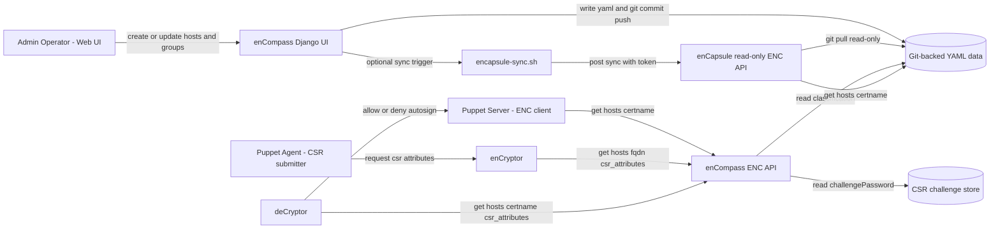

# enCompass + enCapsule + enCryptor

## preface

_I started coding this project alone, but I crossed paths with Copilot and we decided to join forces and work on it together._  
I do not master some of the frontend technologies (Ajax, jQuery), so Copilot has been a great help to implement the UI and related logic.

This project is mirrored on [Codeberg](https://codeberg.org/GEANT/docker-encompass) and [Github](https://github.com/GEANT/docker-encompass), and the artifacts are pushed to Codeberg.  
If Open Source is your thing, please consider starring and contributing on Codeberg: [codeberg.org/GEANT/docker-encompass](https://codeberg.org/GEANT/docker-encompass).

If you are searching for a **Puppet ENC** implementation, this repository provides a production-oriented  
**Puppet External Node Classifier** with Docker deployment, host/group classification, and ENC API endpoints.

enCompass is a Django-based Puppet External Node Classifier (ENC) packaged for Docker.  
It provides a web UI to manage hosts and groups, plus read-only ENC endpoints exposed by both enCompass and enCapsule.

enCapsule is an optional agent for enCompass that can be used to provide high availability for the ENC API.  
It does not depend on a database and boots up in just 1 second, making it ideal for an autoscaling setup.

This repository also includes optional `enCryptor` and `deCryptor` components that enable certificate  
auto-signing flows through CSR `challengePassword` generation and validation.

**Demo site**: [encompass-demo.geant.org](https://encompass-demo.geant.org/)  
**Repository URL**: [codeberg.org/GEANT/docker-encompass](https://codeberg.org/GEANT/docker-encompass)  
**site.pp vs enCompass ENC**: [codeberg.org/GEANT/docker-encompass/docs/SITEPP_VS_ENC.md](https://codeberg.org/GEANT/docker-encompass/src/branch/main/docs/SITEPP_VS_ENC.md)  


## Index

- [Features](#features)
- [Application Flow](#application-flow)
- [Development Guide](#development-guide)
- [Deployment](#deployment)
  - [Nomad Deployment](#nomad-deployment)
  - [Kubernetes Deployment](#kubernetes-deployment)
  - [Docker Compose](#docker-compose)
    - [Quick Start (Docker)](#quick-start-docker)
- [Endpoints](#endpoints)
- [enCryptor + deCryptor (Optional)](#encryptor--decryptor-optional)
- [Puppet ENC Integration](#puppet-enc-integration)
- [Migration Notes](#migration-notes)
- [Puppet ENC Keywords](#puppet-enc-keywords)
- [Configuration](#configuration)
  - [Core settings](#core-settings)
  - [Puppet environments](#puppet-environments)
  - [Authentication](#authentication)
  - [ENC Viewer Basic Auth](#enc-viewer-basic-auth)
  - [SSL](#ssl)
- [Data Backup](#data-backup)
- [HA considerations](#ha-considerations)
- [enCapsule Agent Runtime](#encapsule-agent-runtime)
- [Security Checklist](#security-checklist)
- [Doubts and open questions](#doubts-and-open-questions)
- [ToDo](#todo)
- [License](#license)

## Development Guide

- Full developer notes: [codeberg.org/GEANT/docker-encompass/docs/DEVELOPMENT.md](https://codeberg.org/GEANT/docker-encompass/src/branch/main/docs/DEVELOPMENT.md)
- Sync flow chapter: [codeberg.org/GEANT/docker-encompass/docs/DEVELOPMENT.md#encompass-to-encapsule-sync-flow](https://codeberg.org/GEANT/docker-encompass/src/branch/main/docs/DEVELOPMENT.md#encompass-to-encapsule-sync-flow)

## Features

- Host and group management UI
- ENC host query view for classification checks
- Autoscale is possible. The container is stateless
- LDAP and Database authentication modes
- Optional read-only basic auth for ENC endpoints
- Optional SSL listeners through Nginx
- Persistent YAML data via Git repository

## Application Flow



## Deployment

### Nomad Deployment

You can use [encompass-demo.nomad](https://codeberg.org/GEANT/docker-encompass/src/branch/main/examples/encompass-demo.nomad) and adjust it to your needs.

The job contains:

- service registration for Consul
- secrets templates fetched from Vault
- tags declarations for Traefik

### Kubernetes Deployment

Help needed!

### Docker Compose

- Docker + Docker Compose
- Open local ports: `8080`, `8081`, `8443`, `8444`

#### Quick Start (Docker)

_The following instructions are not intended for a production grade deployment._

1. Copy environment variables file:

    ```bash
    cp vars.example vars
    ```

2. Review and update `vars` for your environment (LDAP host, secrets, allowed hosts, SSL paths, etc.).

3. Build and start:

    ```bash
    docker compose up --build
    ```

4. Open UI:

    - `http://localhost:8080/encompass/`

## Endpoints

- enCompass
  - `8080`: web UI (HTTP)
  - `8081`: ENC read-only endpoint (HTTP)
  - `8443`: web UI (HTTPS, when `USE_SSL=true`)
  - `8444`: ENC read-only endpoint (HTTPS, when `USE_SSL=true`)
- enCapsule (optional profile)
  - `9081`: ENC read-only endpoint (HTTP; container `8081` exposed on host `9081` in Docker Compose)

Additional enCompass CSR endpoints (usable for external provisioning):

- `GET /hosts/<fqdn>/csr_attributes`
- `GET /groups/<name>/csr_attributes`

Response example:

```yaml
---
custom_attributes:
  challengePassword: secure_password
```

CSR endpoint authentication:

- Set `CSR_API_KEY` in `vars`.
- Send the token in header `X-CSR-API-KEY`.
- Applies to both enCompass and enCapsule CSR endpoints.

Example:

```bash
curl -s -H "X-CSR-API-KEY: $CSR_API_KEY" \
  http://enc.example.org:8081/hosts/node1.example.org/csr_attributes
```

## enCryptor + deCryptor (Optional)

`enCryptor` is an optional helper component for provisioning workflows that
retrieve CSR `challengePassword` values from enCompass/enCapsule and write the
expected YAML blob for autosign use cases.

`deCryptor` is an optional Puppet autosign policy helper that validates incoming
CSR `challengePassword` values against enCompass/enCapsule.

Component names are `enCryptor` and `deCryptor`; executable names are
`encryptor` and `decryptor`.

Full documentation:

- [docs/ENCRYPTOR.md](docs/ENCRYPTOR.md)
- [codeberg.org/GEANT/docker-encompass/docs/ENCRYPTOR.md](https://codeberg.org/GEANT/docker-encompass/src/branch/main/docs/ENCRYPTOR.md)
- [docs/DECRYPTOR.md](docs/DECRYPTOR.md)
- [codeberg.org/GEANT/docker-encompass/docs/DECRYPTOR.md](https://codeberg.org/GEANT/docker-encompass/src/branch/main/docs/DECRYPTOR.md)

## Puppet ENC Keywords

This project is relevant to searches and documentation around:

- Puppet ENC
- Puppet External Node Classifier
- external_nodes and node_terminus integration
- Dockerized Puppet ENC
- high-availability ENC endpoint for Puppet Server

## Puppet ENC Integration

In principle you can simply use curl against the ENC endpoint as follows:

```bash
curl -s http://enc.example.org:8081/hosts/\$1
```

If you have round-robin DNS, or SRV records, you can place [puppet-enc.sh](examples/puppet-enc.sh) on the Puppet Server host (not inside Puppet agent nodes), for example:

```bash
sudo install -m 0755 puppet-enc.sh /etc/puppetlabs/puppet/enc/puppet-enc.sh
```

Required tools on Puppet Server:

`bash`, `curl`, `dig`, `getopt`

Create a small wrapper so Puppet can pass the node certname (`$1`) to the script:

```bash
sudo tee /etc/puppetlabs/puppet/enc/enc-wrapper.sh >/dev/null <<'EOF'
#!/usr/bin/env bash
exec /etc/puppetlabs/puppet/enc/puppet-enc.sh \
  --node "$1" \
  --server encompass.example.org \
  --srv
EOF
sudo chmod 0755 /etc/puppetlabs/puppet/enc/enc-wrapper.sh
```

puppet-enc.sh help:

```bash
bash ./examples/puppet-enc.sh --help

Usage: puppet-enc.sh --node <node> --server <hostname> [--srv | --rrdns --port <port> | --port <port>] [--user <username> --password <password>]
       puppet-enc.sh -h | --help

  -n | --node      Node to query
  -s | --server    Server hostname/IP to connect
  -u | --user      Username (jointly required with --password)
  -p | --password  Password (jointly required with --user)
  --srv            Resolve endpoint via SRV record _puppet8._tcp.<server>
  --rrdns          Resolve <server> to multiple A/AAAA records and try each with --port
  --port           Static port (required for non-SRV mode)
```

Configure Puppet Server in `/etc/puppetlabs/puppet/puppet.conf`:

```ini
[server]
node_terminus = exec
external_nodes = /etc/puppetlabs/puppet/enc/enc-wrapper.sh
```

Apply and verify:

```bash
sudo systemctl restart puppetserver
sudo puppet config print node_terminus external_nodes --section master
```

The ENC command must return valid YAML for the requested node and exit with code `0`.

## Migration Notes

If you are migrating from `site.pp`-based classification to ENC, you can start safely with a minimal ENC setup:

- Keep only `default` in ENC and assign one test profile/class.
- Validate one or a few nodes first.
- Gradually add host/group-specific rules after confidence is built.

About lookup/precedence:

- enCompass ENC data resolves in this order: exact host -> first matching group selector -> `default`.
- In OpenVox/Puppet compilation, `site.pp` is evaluated before ENC classification is applied.
- This means broad catch-all logic in `site.pp` can conflict with or dilute the intended ENC-driven model.

Operational guidance:

- Avoid keeping competing classification logic in both ENC and `site.pp` for the same nodes.
- Remove or narrow broad catch-all rules in `site.pp` when adopting ENC.
- If ENC omits `environment`, Puppet uses the node/default environment (commonly `production`).
- Detailed comparison: [site.pp vs enCompass ENC](docs/SITEPP_VS_ENC.md).

## Configuration

Main runtime configuration is in `vars` (copied from `vars.example`).

### Core settings

- `DEBUG`: Django debug mode
- `SECRET_KEY`: Django secret key (generate a unique value)
- `CSR_CHALLENGE_KEY`: dedicated symmetric key for encrypted CSR `challengePassword` storage
- `ALLOWED_HOSTS`, `CSRF_TRUSTED_ORIGINS`, `CORS_ALLOWED_ORIGINS`
- `TIME_ZONE`, `LANGUAGE_CODE`

### CSR challengePassword store

- enCompass now keeps a dedicated encrypted map for CSR attributes under `/data/csr_challenges.yaml`.
- Entries are created automatically on host/group save with get-or-create behavior (no overwrite of existing value).
- Canonical entity names are `host/<fqdn>` and `group/<groupname>`.
- Rotate values with Django command:

```bash
python manage.py rotate_csr_challenge --host node1.example.org
python manage.py rotate_csr_challenge --group default
python manage.py rotate_csr_challenge --all
```

### Logging

- `ENCOMPASS_LOGGING`: Django/UI runtime log level (`DEBUG|INFO|WARNING|ERROR|CRITICAL`)
- `ENCAPSULE_LOGGING`: enCapsule agent log level (`DEBUG|INFO|WARNING|ERROR|CRITICAL`)
- `LDAP_AUTH_DEBUG`: LDAP auth logger level (`DEBUG|INFO|WARNING|ERROR|CRITICAL`)

Backward compatibility: `AUTH_DEBUG` is still accepted as a fallback for LDAP logging, but `LDAP_AUTH_DEBUG` is preferred.

### Puppet environments

- `FEATURE_BRANCH=true|false`
- `PUPPET_ENVIRONMENTS='["test", "uat", "production"]'`

UI behavior:

- When `FEATURE_BRANCH=true`, users can type any environment name in the host/group edit forms (free-text input).
- When `FEATURE_BRANCH=false`, the environment field is a drop-down populated from `PUPPET_ENVIRONMENTS`.

Host selectors in `groups.yaml` (`hosts` list):

- Plain value (for example `web-`) => prefix match (`hostname.startswith("web-")`)
- Regex value wrapped in slashes (for example `/^web-[0-9]+\.example\.org$/`) => regex full match

Resolution order:

- Exact host entry in `hosts.yaml`
- Then first matching selector in `groups.yaml` order (and `hosts` list order inside each group)
- Then `default` group

Validation guardrails:

- Group host selectors are validated on create/update to prevent ambiguous overlaps across groups.
- Overlapping selectors (for example plain prefixes like `test-` and `test-app-`) are rejected with a validation error.
- `ENC_OVERLAPPING_DEFINITIONS_ENABLED=true` disables that overlap rejection and allows overlapping enCompass definitions.
- This deviates from the recommended non-overlapping selector pattern, but remains deterministic and convenient for migrations because merge resolution order is unchanged (first matching selector wins).

### PuppetDB unclassified hosts

The UI page `/encompass/unclassified_hosts/` lists nodes considered unclassified.

A node is marked unclassified when its resolved ENC payload (`environment`, `classes`, `parameters`) matches the ENC `default` group profile.

Configuration:

- `UNCLASSIFIED_HOSTS_ENABLED`: enable/disable the unclassified hosts page logic (`true`/`false`, default: `true`)
- `PUPPETDB_SCHEMA`: PuppetDB scheme (default: `http`)
- `PUPPETDB_HOST`: PuppetDB host (default: `puppetdb.service.ha.geant.net`)
- `PUPPETDB_PORT`: PuppetDB port (default: `8080`)
- `PUPPETDB_TIMEOUT`: HTTP timeout in seconds for the PuppetDB call (default: `20`)

The nodes endpoint is built internally as:

- ``${PUPPETDB_SCHEMA}://${PUPPETDB_HOST}:${PUPPETDB_PORT}/pdb/query/v4/nodes``

### Authentication

- `AUTH_LDAP_ENABLED=true|false`
- `AUTH_MYSQL_ENABLED=true|false`

LDAP mode requires the `LDAP_*` variables.

Local Django auth mode (`AUTH_MYSQL_ENABLED=true`) supports bootstrap users via:

- `ENC_BOOTSTRAP_ADMIN_PASSWORD`
- `ENC_BOOTSTRAP_VIEWER_PASSWORD`

If omitted, defaults (`admin` / `viewer`) are used for first bootstrap; change these immediately in non-development environments.

### ENC Viewer Basic Auth

Set `ENC_VIEWER_PASSWORD` to protect read-only ENC endpoints with basic auth.

- Username: `encompass`
- Password: value of `ENC_VIEWER_PASSWORD`

Leave empty to disable endpoint basic auth.

### SSL

Enable HTTPS listeners by setting:

- `USE_SSL=true`
- `SSL_CERT_PATH`
- `SSL_KEY_PATH`

### Git settings

The application accepts the Git SSH private key in either of these forms:

- `GIT_REPO_PRIVATE_SSH_KEY`: inline key content (works well in `docker-compose` env files)
- `GIT_REPO_PRIVATE_SSH_KEY_FILE`: path to a file containing the key (recommended for Kubernetes/Nomad secrets)

If both are set, `GIT_REPO_PRIVATE_SSH_KEY` is used.

Branch behavior:

- `GIT_BRANCH`: branch used by enCompass for clone/fetch/checkout/commits/pushes.

Typical setup:

- Set `GIT_BRANCH=main` (or your target branch, for example `dev` or a feature branch).

## HA considerations

Once configured on the Vox/Puppet server, ENC becomes essential for its operation and must be highly resilient.

enCompass is stateless and supports autoscaling. It can be set up to run at least two instances for High Availability and inherently load balancing.

The database is only crucial for the UI’s operation but is irrelevant for the ENC endpoint.

## enCapsule Agent Runtime

The repository now includes an agent runtime named **enCapsule**.

- It serves only read-only ENC endpoints (`/hosts`, `/groups`) and `/healthz`.
- It does not run Django migrations and does not require MySQL to start.
- It uses the same shared ENC core logic as enCompass.

### Run enCapsule with Docker Compose

A full description of enCapsule and its sync flow with enCompass is available in the [enCapsule documentation](https://codeberg.org/GEANT/docker-encompass/src/branch/main/docs/ENCAPSULE.md).

```bash
docker compose --profile encapsule up --build encapsule
```

Default exposed port in compose profile:

- `9081` -> enCapsule read-only ENC API

### Optional Git sync trigger

You can configure a token and trigger a pull/update of ENC data:

- `ENCAPSULE_SYNC_TOKEN=<your-token>`
- `POST /sync` with header `X-Encapsule-Token: <your-token>`

Example:

```bash
curl -X POST \
  -H "X-Encapsule-Token: ${ENCAPSULE_SYNC_TOKEN}" \
  http://localhost:9081/sync
```

### Fan-out sync to multiple enCapsule agents

Use `/usr/local/bin/encapsule-sync.sh` from the enCompass runtime after a successful Git push.

When host/group data is changed from enCompass, the application automatically:

1. commits changed ENC YAML files (if any),
2. pushes to the configured Git branch,
3. triggers enCapsule sync fan-out.

Git sync execution mode is configurable:

- `GIT_SYNC_MODE=sync` (default): request waits for commit/push/sync result
- `GIT_SYNC_MODE=async`: request returns quickly and sync runs in a background worker

Reliability and latency controls:

- `GIT_SYNC_TIMEOUT` (seconds, default `30`)
- `GIT_SYNC_RETRIES` (default `2`)
- `GIT_SYNC_RETRY_DELAY` (seconds, default `2`)

Common variables:

- `USE_ENCAPSULE`: `true|false` (when `false`, sync fan-out is skipped)
- `ENCAPSULE_SYNC_TOKEN`: shared token expected by each enCapsule `/sync`
- `ENCAPSULE_SYNC_SCHEME`: `http` or `https` (default `http`)
- `ENCAPSULE_SYNC_PATH`: endpoint path (default `/sync`)
- `ENCAPSULE_SYNC_TIMEOUT`: curl timeout in seconds (default `5`)
- `ENCAPSULE_SYNC_HOST`: one or more comma-separated entries

Accepted `ENCAPSULE_SYNC_HOST` entries:

- `enc-a.internal` (uses default port `8081`)
- `enc-a.internal:9081` (explicit port)
- `http://enc-a.internal:9081/sync` (full URL)
- `_encapsule-sync._tcp.enc.example.org` (SRV record, auto-discovered)

Example:

```bash
ENCAPSULE_SYNC_HOST="encapsule-a.internal,encapsule-b.internal"
ENCAPSULE_SYNC_TOKEN="<shared-token>"
```

Example:

```bash
ENCAPSULE_SYNC_HOST="_encapsule-sync._tcp.enc.example.org"
ENCAPSULE_SYNC_TOKEN="<shared-token>"
```

Run manually:

```bash
/usr/local/bin/encapsule-sync.sh
```

The script sends requests in parallel and fails if any target fails.
If `ENCAPSULE_SYNC_HOST` is empty, the script exits successfully without sending requests.

In Nomad, SRV entries are typically easiest. In non-SRV environments, use explicit hostnames/IPs.

## Data Backup

Host/group YAML data is stored in the configured Git repository.

When using LDAP authentication, the data stored in the database is not critical. It can be rebuilt from scratch and only session cookies will be lost.

When the authentication backend is MySQL, the database stores user information. It’s recommended to back up your MySQL database when Database authentication is used.

## Security Checklist

- Set a strong `SECRET_KEY`
- Disable `DEBUG` in production
- Restrict `ALLOWED_HOSTS` and `ALLOWED_CIDR_NETS`
- Set non-default bootstrap passwords for local auth mode
- Enable `USE_SSL` for production exposure

## Doubts and open questions

- enCompass allows setting empty classes for `hosts`/`groups`, which is valid and it might come to hand in some edge cases. Is it sensible and appropriate?

## ToDo

- ¡Nada (at the moment)!

## License

This project is licensed under the GNU General Public License v3.0 or later (GPL-3.0-or-later).
See [LICENSE](https://codeberg.org/GEANT/docker-encompass/src/branch/main/LICENSE) for details.

SPDX-License-Identifier: GPL-3.0-or-later
