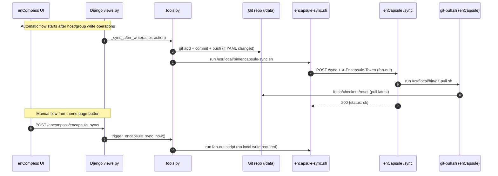

# enCompass Development

enCompass is a Django-based Puppet External Node Classifier (ENC) packaged for Docker.
It provides a web UI to manage hosts and groups, plus read-only ENC endpoints for external consumers.

Demo site: [encompass-demo.geant.org](https://encompass-demo.geant.org/)

## Index

- [Development Notes](#development-notes)
- [Encompass To Encapsule Sync Flow](#encompass-to-encapsule-sync-flow)
- [Local Python Run (Optional)](#local-python-run-optional)
- [Troubleshooting](#troubleshooting)
- [ToDo](#todo)

## Development Notes

- In debug mode, Django dev server is used internally.
- In non-debug mode, Gunicorn serves Django behind Nginx.
- Static files are collected automatically on container startup.
- Database migrations are applied automatically when pending.

## Encompass To Encapsule Sync Flow



### Runtime controls

- `USE_ENCAPSULE=true|false`: enables/disables fan-out trigger.
- `ENCAPSULE_SYNC_TOKEN`: shared token required by enCapsule `/sync` endpoint (environment variable on both services).
- Runtime-managed in Global Settings (DB/UI):
  `GIT_SYNC_MODE`, `GIT_SYNC_TIMEOUT`, `GIT_SYNC_RETRIES`, `GIT_SYNC_RETRY_DELAY`,
  `ENCAPSULE_SYNC_USE_SRV`, `ENCAPSULE_SYNC_HOST`, `ENCAPSULE_SYNC_SCHEME`, `ENCAPSULE_SYNC_PORT`, `ENCAPSULE_SYNC_TIMEOUT`.

### Read-only behavior in enCapsule

- enCapsule runs `git-setup.sh` at startup in read-only mode via `GIT_READ_ONLY=true` in `files/encapsule-entrypoint.sh`.
- enCapsule `/sync` uses `git-pull.sh`, a pull-only script that never creates branches or pushes.

## Local Python Run (Optional)

Use this only if you are developing outside Docker:

```bash
python -m venv .venv
source .venv/bin/activate
pip install -r requirements.txt
cd encompass
python manage.py migrate
python manage.py runserver
```

## Troubleshooting

- `403` on `/hosts` or `/groups` via ENC endpoint:
  expected behavior for external proxy paths.
- `409 Conflict` on `/hosts` or `/groups` writes:
  another write operation currently holds the lock; retry the request.
- Login issues with LDAP:
  verify LDAP settings in Global Settings and directory reachability from the container.
- SSL startup failure:
  confirm certificate/key files exist and are readable in container paths.
- Nginx error `stat() ... /code/static/static/... failed (13: Permission denied)` and broken CSS:
  static permissions were too restrictive; startup now normalizes `/code/static/static` with `a+rX` after `collectstatic` (common with strict Nomad/Kubernetes `umask`).

## ToDo

- add var GIT_COMMIT=true/false, to commit on save and pull before rendering the tables
- regex for hosts in groups.yaml
